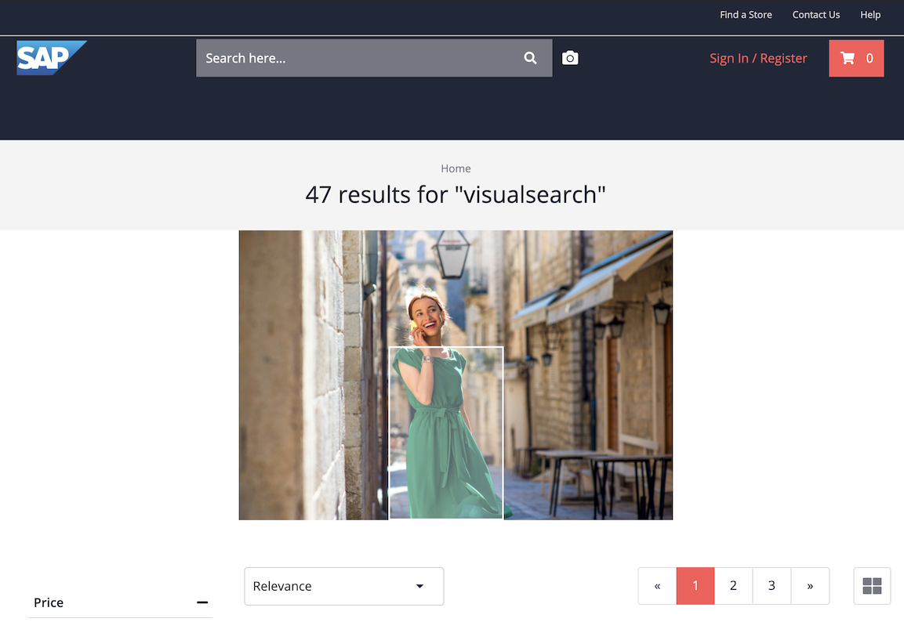

# SAP Commerce Cloud Spartacus Storefront Visual Search Sample

## Description

This sample contains a set of extensions and add-ons for SAP Commerce Cloud (CCv2), microservices, and the Spartacus Storefront components that allow consumers to search for products by uploading a picture.

Visual Search is an integration with Spartacus and SAP Commerce Cloud. This allows a user to search for products with an image. Therefore the user uploads an image which is analyzed by a third party (e.g. Syte.ai). As result, the user sees the image with bounding boxes. To search for a product, the user clicks on the corresponding item and the search page displays similar products that are in your product catalog.

The architecture is described in the [Visual Search Architecture document](doc/VisualSearchArchitecture.md).



## Requirements

You need following requirements before you integrate this Visual Search example:

- A SAP Commerce Cloud instance which is already prepared for Spartacus.
- A Spartacus project, where you can integrate the Visual Search components. Please, take also a look at the [Spartacus requirements](https://github.com/SAP/spartacus#requirements).
- The possibility to install the Visual Search Webservice with Docker.
- (Optional) a Redis instance with access credentials is required.
- Administrator access to the SAP Commerce Cloud instance to install a Visual Search extension.
- A Syte.ai license with the license keys and the possibility to upload your complete product catalog.

## Download and Installation

Following steps are required to setup the Visual Search example with Spartacus and SAP Commerce Cloud.

### Prepare SAP Commerce Cloud for Spartacus

The Spartacus documentation [Installing SAP Commerce Cloud for use with Spartacus](https://sap.github.io/cloud-commerce-spartacus-storefront-docs/installing-sap-commerce-cloud/) has the latest information to install and configure SAP Commerce Cloud for Spartacus. Please follow these steps.

### Integrate Visual Search components

The `visualsearchstore/projects/cxlabs/src/visualsearch/` folder contains the Visual Search project.

### Deploy Visual Search Microservice

The Visual Search microservice is available as Java Spring-Boot web application.

#### Visual Search Start

To start the Visual Search microservice locally go into the `imageservice` directory and execute the Gradle script:

```shell
cd imageservice
./gradlew bootRun
```

The syte.ai configuration can be adjusted in the file `src/main/resources/application.properties`:

- syte.url — the Syte.ai hostname and port
- syte.accountid — your Syte.ai account id
- syte.signature — your Syte.ai signature

It is also possible to set these values as environment variables:

- SYTE_URL — the Syte.ai hostname and port
- SYTE_ACCOUNTID — your Syte.ai account id
- SYTE_SIGNATURE — your Syte.ai signature

#### Visual Search Microservice Dockerimage

To build the Docker image go into the `imageservice` directory and build a JAR file:

```shell
cd imageservice
./gradlew build
```

```shell
docker build --build-arg JAR_FILE=build/libs/image-service-0.1.0.jar -t hybris/image-service .
```

Then you can install and run the docker image with following parameters:

```shell
docker run \
  -e SYTE_URL=<SYTE_URL> \
  -e SYTE_ACCOUNT_ID=<SYTE_ACCOUNT_ID> \
  -e SYTE_SIGNATURE=<SYTE_SIGNATURE> \
  -e CACHE_NAME="searchImageData" \
  -e CACHE_REDIS_HOST=localhost \
  -e CACHE_REDIS_PORT=0 \
  -e CORS_ALLOWED_ORIGINS="*" \
  -p 8080:5000 \
  hybris/image-service:latest
```

- SYTE_URL — the Syte hostname and port
- SYTE_ACCOUNT_ID — your Syte account id
- SYTE_SIGNATURE — your Syte signature

See also [Spring Boot with Docker](https://spring.io/guides/gs/spring-boot-docker/).

### Syte.ai license and product catalog integration

Please contact Syte.ai for further information.

## Known Issues

No known issues at the moment.

## How to obtain support

In case you find a bug or need support, please [open an issue](https://github.com/SAP-samples/commerce-cloud-spartacus-storefront-visual-search-sample/issues/new).

## License

Copyright (c) 2020 SAP SE or an SAP affiliate company. All rights reserved. This file is licensed under the Apache Software License, version 2.0 except as noted otherwise in the [LICENSE](LICENSE) file.
