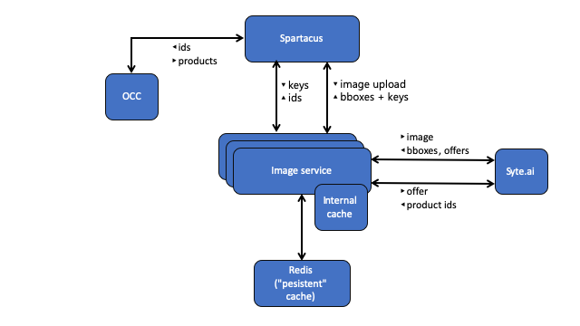

# Visual Search Architecture

The Visual Search example is based on following components and services:

- SAP Commerce Cloud
- Spartacus frontend
- Visual Search Spartacus project
- Visual Search web service
  - internal cache
- 3rd party provider e.g. Syte.ai
- (optional) Redis server



## SAP Commerce Cloud

The SAP Commerce Cloud instance offers OCC data for the Spartacus frontend.

## Spartacus frontend

_[Spartacus](https://github.com/SAP/spartacus) is a lean, Angular-based JavaScript storefront for SAP Commerce Cloud that communicates exclusively through the SAP Commerce Cloud REST API._

## Visual Search Spartacus project

The Visual Search Spartacus project extends the Spartacus frontend for Visual Search. These components offer the following functionality:

- extend the Search field
- communicate with the Visual Search microservice
- shows the upload image with bounding boxes of the analysed image
- opens the search page for a selected item

See also [Visual Search Spartacus Components Internals](VisualSearchSpartacusComponentsInternals.md)

### Search field

Extend the search field with an image uploader button.

### Visual Search Microservice — Image Upload

The image uploader component and service uploads an image to the Visual Search microservice. The microservice uploads this image to a 3rd party provider for image analysis (e.g. bounding boxes) and returns a list of bounding boxes.

### Image Holder

The image holder component shows the uploaded image with bounding boxes.

#### Bounding Boxes and Select Item

Based on the third party's result, bounding boxes are shown. The bounding boxes are clickable to select an item.

### Visual Search Microservice — Similar Products

The microservice calls the 3rd party provider to get a list of similar products.

### Search Result Page

The search result page shows the found products.

## Visual Search Microservice

The Visual Search microservice is an integration to a 3rd party visual search provider to get bounding boxes and a list of visually similar products. The microservice offers following endpoints:

- /imageservice/upload - upload and analyse an image; for each detected item returns bounding boxes
- /imageservice/{id} - returns list of visually simialar product ids for bounding box id

See also [Visual Search Microservice Architecture](VisualSearchMicroserviceArchitecture.md)

### Upload Image

When Search Image Handler receives a POST request to upload image, it expects an image to be sent in a form, with 'file' as input key. Then, it makes a nonblocking call to 3rd party provider, process response and caches data. The response of the handler is Mono of ServerResponse with Mono of SearchImageData object in body.

### Get Similar Products

The reponse of get similar products GET request is Mono of ServerResponse with Flux of String in body. For the provided id in request, the system will first try to get data from cache. If not found, the 3rd party provider will be called, reponse processed and cache updated.

## Visual Search Microservice Caching

Two level caching is used in the application: embedded EH cache, as first level caching and Redis, as an optional second level. If data is missing from the first level cache, it will be search for in the second level cache. If found, the first level cache will be updated. For more information, please refer to [Visual Search Microservice Architecture](VisualSearchMicroserviceArchitecture.md)

EH cache properties:

```.properties
cache.ehcache.idle.time=6000
cache.ehcache.heap.entries.size=2000
cache.ehcache.offheap.mb=100
```

## (Optional) Redis

If the configuration for Redis is provided and connection can be estiblished, the application will use Redis Cache manager for second level caching. If not, NoOpCacheManager will be used instead.

Redis properties:

```.properties
cache.redis.host=
cache.redis.port=
cache.redis.timeoutSeconds=
cache.redis.cacheExpirations.myControlledCache=
```

## 3rd party provider — Syte

The example code uses Syte as 3rd party provider. Therefore, please, provide credentials for your Syte account:

```.properties
syte.accountid=
syte.signature=
```
