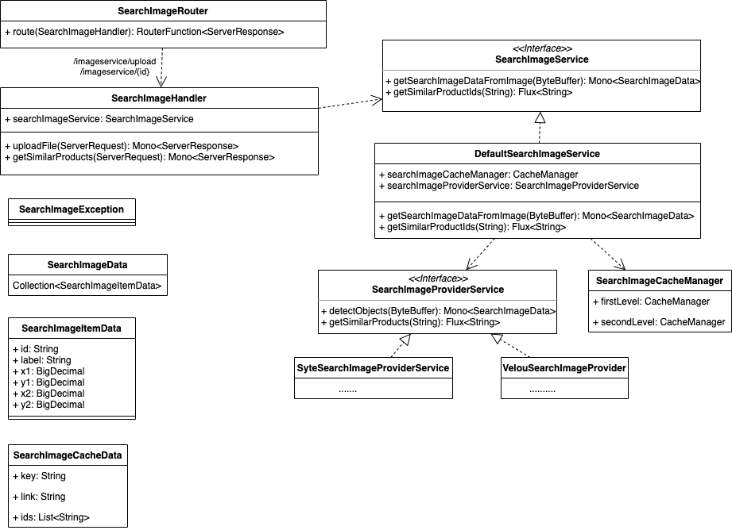

# Visual Search Microservice Architecture

The Visual Search Microservice is build on these components:

- WebFlux and functional web framework
- EHCache and Redis



## Caching


## API

The microservice uses two API endpoints. One endpoint to upload an image and a second endpoint to receive similar products for a selected category.

### Upload

API endpoint: /imageservice/upload

The image is uploaded as multipart/form-data. The microservice response with a Json as application/json content-type:

#### Example for Upload Response

```json
{
    "bb": [
        {
            "id": "74521274-d933-4958-a892-4445fbb92dd0",
            "label": "Dresses",
            "x1": 0.31385132670402527,
            "y1": 0.20146168768405914,
            "x2": 0.8939447402954102,
            "y2": 0.9185398817062378
        },
        {
            "id": "1153bb5e-8301-45ec-8999-5def53f6c54f",
            "label": "Shoes",
            "x1": 0.26900753378868103,
            "y1": 0.8612719774246216,
            "x2": 0.44652417302131653,
            "y2": 0.9752789735794067
        }
    ]
}
```

- bb: an array of bounding boxes for each category
- id: the ID of the category
- label: the label name of the category
- x1, y1: upper left corner as percentage values
- x2, y2: bottom right corner as percentage value

### Similar Products

API endpoint: /imageservice/{category id}

When the user selects a bounding box the category ID is used to search similar products. Internally the category ID is mapped to a 3rd party link. Therefore the category ID and 3rd party link is cached in the microservice.

#### Example for Similar Products response

The microservice response with a string with a list of similar product IDs.

```text
"D6502-LDA DC04-RND"
```
