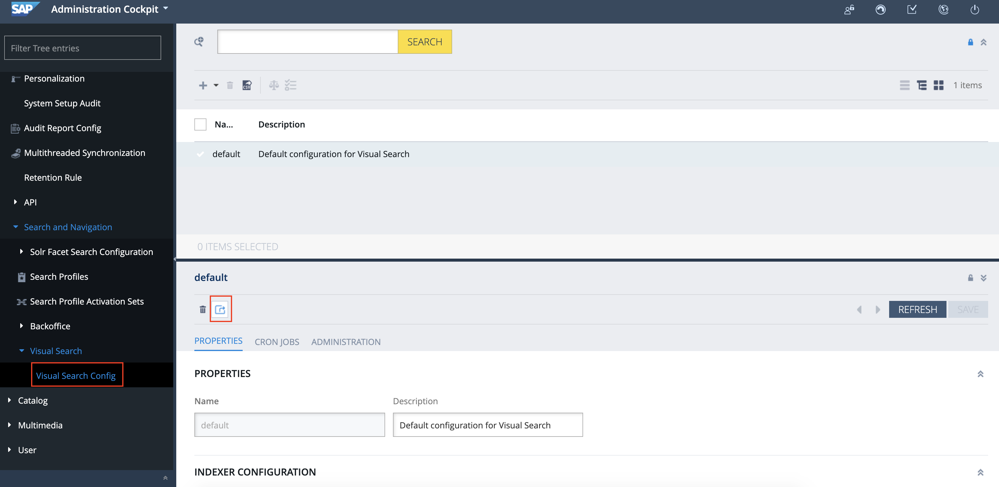
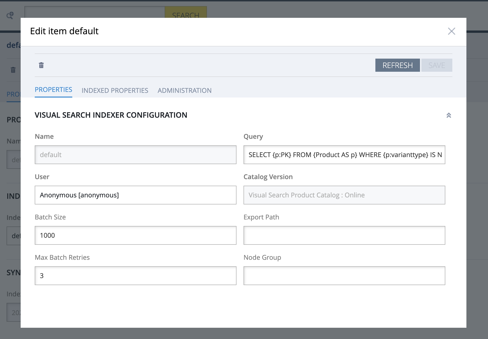
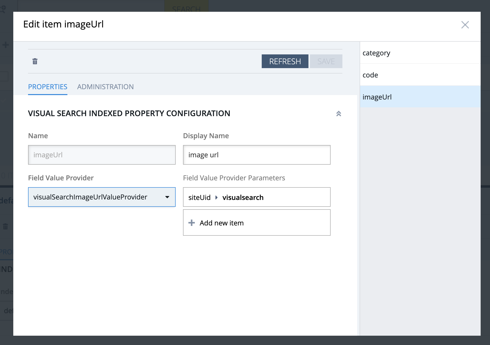
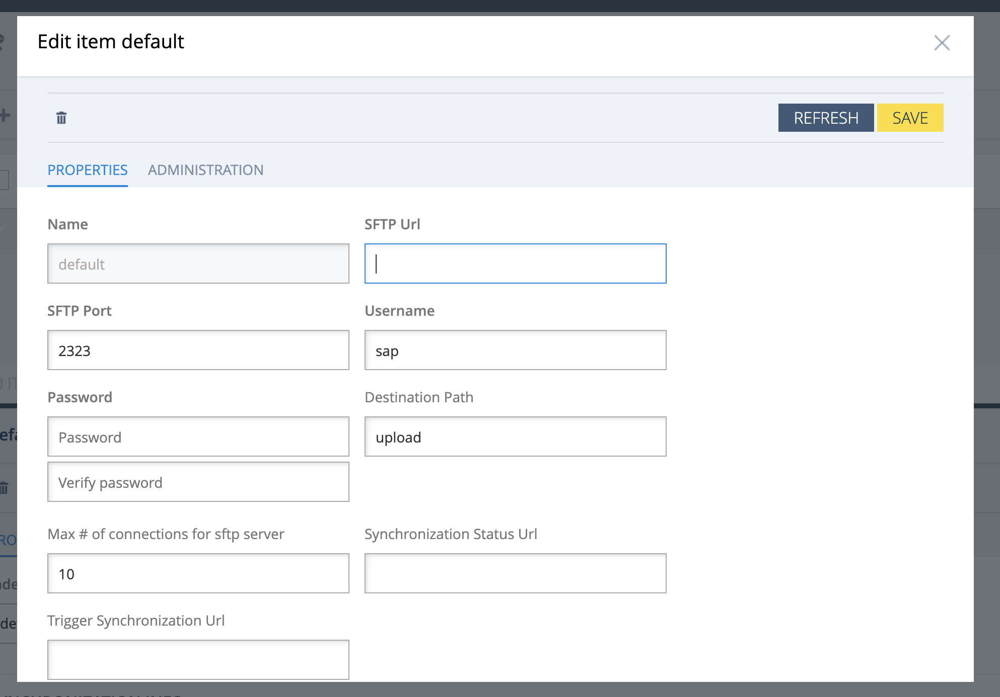
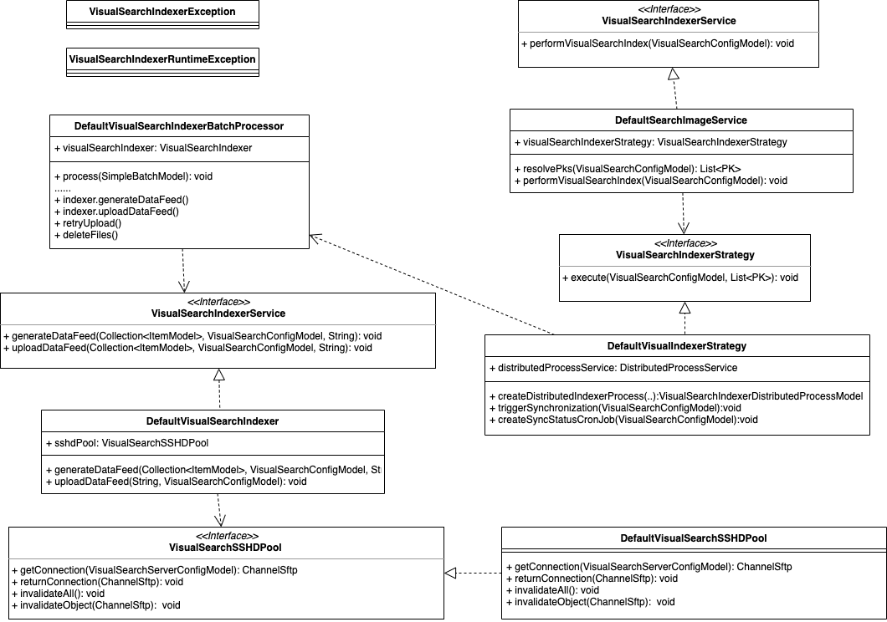

# Visual Search Indexing Process

In order for visual search to work, feautures of product images should be extracted and indexed. As already mention, we are using 3rd party provider for it. We have implemented integration with the provider and automatic way to export data properly and start the process.

When some of the product properties are changes, specially product image, for the best search results product catalog should be synchronized. A backoffice user can start the synchronization process by clicking on the "Synchronize" button. The process consists of 4 steps:

1. generating datafeed (done in parallel generating batches)
2. uploading it to sftp server
3. triggering indexing on 3rd party provider
4. updating the status of the process.

## Configuration

The configuration is divided into two parts: Indexer Configuration, that holds information about indexing itself and Server Configuration, holding information about 3rd party credentials and urls.

### Index Configuration

- name - unique name of the indexer configuration
- query - FlexibleSearchQuery, datafeed will be generated for only the items resulting by executing this query. It is adviced to use the same query as the one for FULL Search Indexing
- user - user to execute the query
- catalog version
- batch size - for how many products the batch should be generated
- export path - directory where batches should be saved. If empty, file will be generated under platform temp dir
- max batch retries - maximum number of retries while uploading batches. Since sftp connection can be unstable, it is recommended to set it greater than 0
- node group - Allows to control on which node group of a cluster process will be executed
- indexed properties

    * name - unique name of the property
    * display name - display name of the property in the datafeed
    * field value provider - Bean name of value provider for the property. The provider defines how the property value of the item should be extracted. All providers must implement VisualSearchValueProvider interface.
    * value provider parameters - parameters for the field value provider

### Server Configuration

- name - unique name of the server configuration
- url - sftp server url
- port - sftp server port
- username - sftp server username
- password - sftp server password
- destination path - directory on sftp server
- max total connections - maximum number of sftp connection pool
- trigger sync url - calling this endpoint will trigger indexing process on 3rd party provider
- sync status url - endpoint for getting information about indexing process on 3rd party provider

